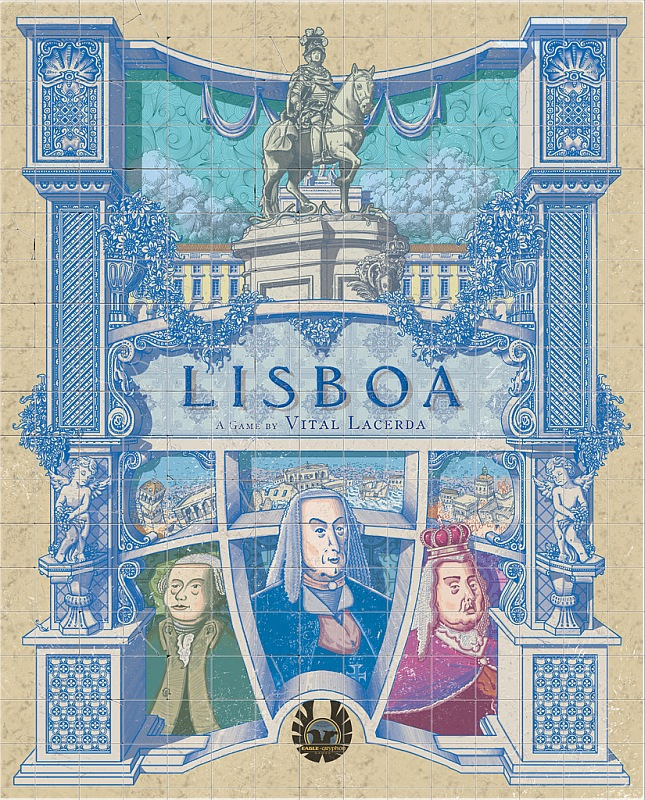

# 行動 2：與貴族交易(國家行動)

 (1).png>)

當你選擇這個行動，你**最多可做兩次**交易，每次交易依序：

1. 選擇一個未被貨物覆蓋的國家行動。_這表示不能選兩次同一個行動。_
2. 從自己倉庫支付一個該行動的貴族需求的貨物，蓋在該行動圖示上。_黃金可以替代任一貨物_
   1. 總建築師：需要**工具**_，或黃金_
   2. 總理大臣：需要**書本**_，或黃金_
   3. 國王：需要**布料**_，或黃金_
3. 執行國家行動

## 總建築師的行動

### 招募公務員

.png>)

從玩家版塊上移動**最多兩個**公務員到**不同的**貴族辦公室。如果辦公室中沒有空位了，把有最多公務員的顏色的公務員踢出一個到辦公室下方的廣場。如果有平手就都各踢一個。

.png>)

### 得到一個重建計畫

 (1).png>)

1. 從遊戲圖版上獲得兩個建築師之一的建設計畫板塊。_兩個建築師沒有分別，主要是對應歷史上的兩個有貢獻的建築師。_
2. 放到玩家圖板上的對應位置。玩家可以持有任意數量的建設計畫板塊。

 (1).png>)

## 總理大臣的行動

### 建造船隻

 (1).png>)

1.  建造船隻只能選擇可以看到的船隻卡（_最上面一張_），

    根據圖版上船隻需求的表支付不同種類的貨物，**種類的數量**等於對應船艙的大小。

    如果是升級船隻只需要船艙容量差距的不同種類數量貨物。
2. 選擇投資組合上方的卡槽。如果超過容量上限則可以棄掉該格的卡。
3. 提升國庫一個等級。_因為新的船隻可以帶來更多貿易增加國家的收入_
4. 獲得投資組合中上方卡片上緣累積的影響力（**包含剛建造的船隻卡**）。

升級船隻的話，原先的貨物會保留。

### 生產貨物

.png>)

_在舊的里斯本時，商業有點不太尋常。主要是因為葡萄牙在文藝復興時期開發了大量的財富。而在大災變之後，經濟復甦是總理大臣的主要目標之一。所以他提出了建造工廠和商店。_

1. 每一個你擁有的商店，從供應堆獲得一個對應的貨物。（種類決定於該商店面向哪個街道）如果取得的貨物數量超過你的倉庫容量，那就不能拿。
2. 每一個生產的種類會調降對應種類的售價一格。（不是看數量，賣出多個同種類的貨物也是調降一格）

## 國王的行動

### 會晤主教

_在這個時期教會透過基督教有著很大的勢力，這對總理大臣來說是一種威脅。所以在他的任期間，他竭盡所能地削弱教會的勢力。他的一些行為無可爭議是好的，比如說結束了異端審判。_

會晤主教來取得神職板塊，根據底下步驟：

1. 將主教順時針移動一步或兩步。主教可達的位置是神職板塊間的間隔。
2. 獲得主教相鄰的兩個神職板塊之一。兩個選一個。放到玩家版塊右上角，每個玩家只能擁有四個神職板塊，如果沒有空位就不能採取這個行動。
3. 結算主教停留和經過路徑上的圖示。

#### 教堂國庫圖示

.png>)

提升國庫等級一格。

#### 教堂影響力圖示

.png>)

在該玩家的回合結束後，進行一次教堂計分。從該玩家開始順時鐘決定，選擇是否要增加影響力，如果要的話根據底下步驟結算：

1. 選擇棄掉任意數量的神職板塊。
2. 立刻獲得棄掉的神職板塊背後的假髮。（分數）
3. [獲得影響力](ying-xiang-li.md#huo-de-ying-xiang-li)。如果沒有神職板塊的玩家不能參與教堂計分，也不會提升影響力。

#### 主教的移動

 (1).png>)

除了國王的國家行動以外，政治卡的獎勵或者建造地的獎勵也可能提供會晤主教的行動。如果只有一個箭頭的話，就只能移動主教一格。

### 獲得皇室恩惠

 (1).png>)

每一個皇室恩惠板塊都對應一位貴族，可以提供一次額外的行動跟隨拜訪該貴族在其他玩家的回合。

每個玩家只能同時擁有每個貴族的恩惠各一個，不能重複。
